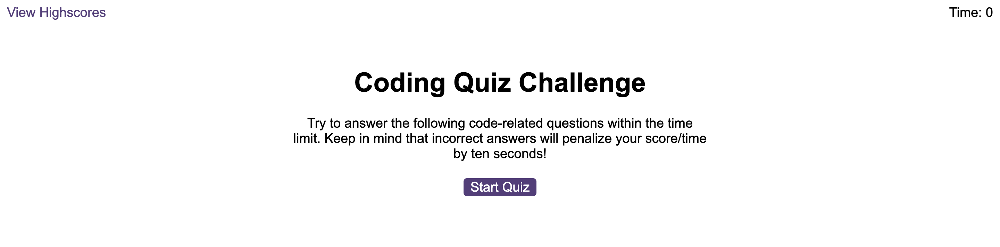

# Module 6 Challenge Web APIs: Code Quiz

In this project we try to develop a Quiz game.
We use java script to let the answer shows randomly and we set a countdown timer.
And we have the high score page and we store the high score at the local stroage.

Github link:
https://github.com/laurabbity915/challenge6_Quiz_Game

Deployed link:
https://laurabbity915.github.io/challenge6_Quiz_Game/

